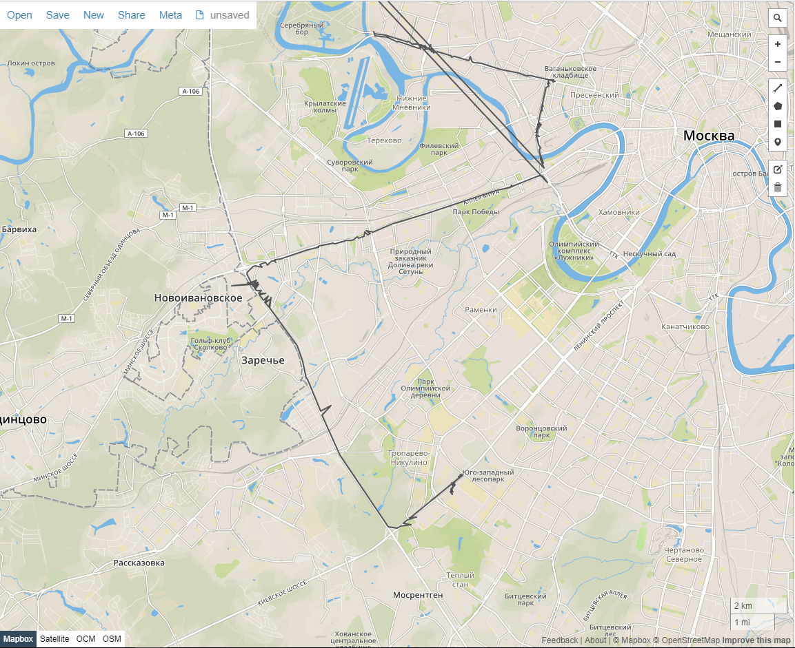
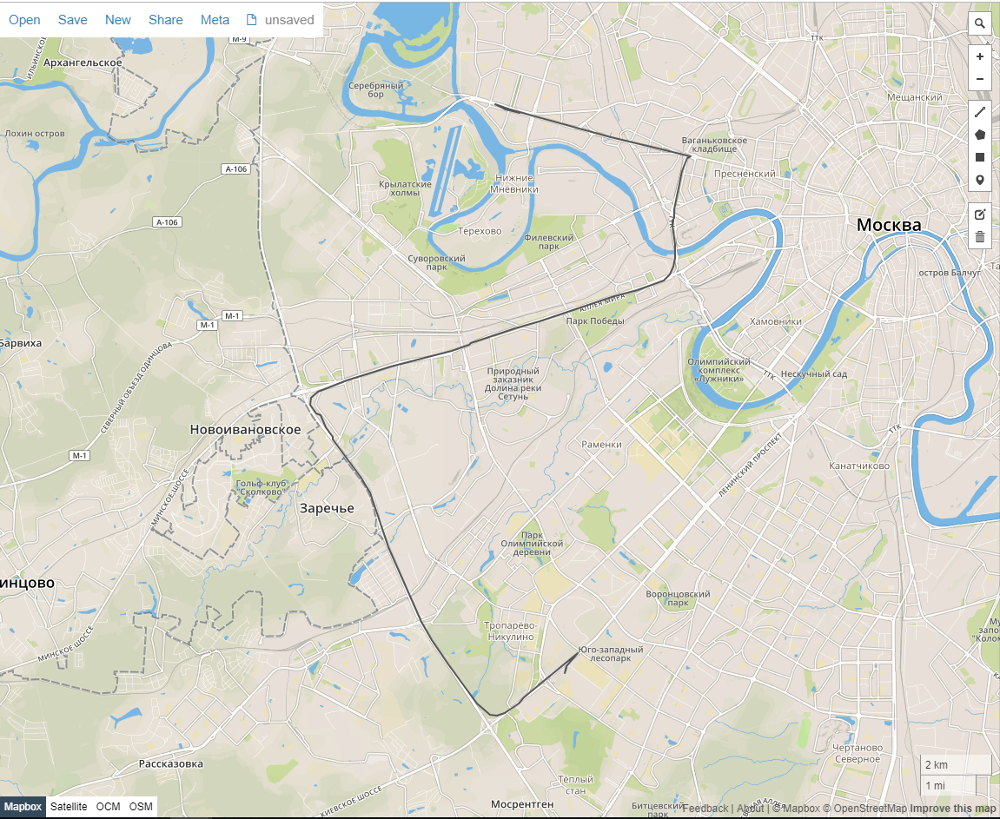

# gps-track-filter

Fixes typical GPS data errors.

## Quick start

```c#
Tuple<double, double, DateTimeOffset>[] rawGpsTrack =
{
    Tuple.Create(55.6519383333333, 37.490125, new DateTimeOffset(2018, 12, 4, 13, 16, 19, 789, TimeSpan.FromMinutes(0))),
    Tuple.Create(55.6515131, 37.4893632, new DateTimeOffset(2018, 12, 4, 13, 16, 23, 789, TimeSpan.FromMinutes(0))),
    Tuple.Create(55.6519383333333, 37.490125, new DateTimeOffset(2018, 12, 4, 13, 16, 27, 789, TimeSpan.FromMinutes(0))),
    Tuple.Create(55.65135, 37.4892033, new DateTimeOffset(2018, 12, 4, 13, 16, 43, 789, TimeSpan.FromMinutes(0))),
    Tuple.Create(55.6519383333333, 37.490125, new DateTimeOffset(2018, 12, 4, 13, 16, 47, 789, TimeSpan.FromMinutes(0))),
    Tuple.Create(55.6513234, 37.4891682, new DateTimeOffset(2018, 12, 4, 13, 17, 3, 790, TimeSpan.FromMinutes(0))),
    Tuple.Create(55.6519383333333, 37.490125, new DateTimeOffset(2018, 12, 4, 13, 17, 7, 790, TimeSpan.FromMinutes(0))),
    Tuple.Create(55.6518866666667, 37.4900783333333, new DateTimeOffset(2018, 12, 4, 13, 17, 23, 790, TimeSpan.FromMinutes(0))),
    Tuple.Create(55.65179, 37.4899816666667, new DateTimeOffset(2018, 12, 4, 13, 17, 27, 790, TimeSpan.FromMinutes(0))),
    Tuple.Create(55.651485, 37.4896166666667, new DateTimeOffset(2018, 12, 4, 13, 17, 35, 790, TimeSpan.FromMinutes(0))),
    Tuple.Create(55.6514033333333, 37.4895116666667, new DateTimeOffset(2018, 12, 4, 13, 17, 39, 791, TimeSpan.FromMinutes(0))),
    Tuple.Create(55.651, 37.4899566666667, new DateTimeOffset(2018, 12, 4, 13, 17, 59, 791, TimeSpan.FromMinutes(0))),
    Tuple.Create(55.6509624, 37.4892313, new DateTimeOffset(2018, 12, 4, 13, 18, 3, 791, TimeSpan.FromMinutes(0))),
    Tuple.Create(55.6505566666667, 37.489675, new DateTimeOffset(2018, 12, 4, 13, 18, 19, 792, TimeSpan.FromMinutes(0))),
    Tuple.Create(55.65011, 37.489775, new DateTimeOffset(2018, 12, 4, 13, 18, 39, 793, TimeSpan.FromMinutes(0))),
    Tuple.Create(55.6505939, 37.488777, new DateTimeOffset(2018, 12, 4, 13, 18, 43, 793, TimeSpan.FromMinutes(0))),
    Tuple.Create(55.649861, 37.4901316, new DateTimeOffset(2018, 12, 4, 13, 19, 3, 793, TimeSpan.FromMinutes(0))),
    Tuple.Create(55.6507395, 37.4888707, new DateTimeOffset(2018, 12, 4, 13, 19, 43, 794, TimeSpan.FromMinutes(0))),
    Tuple.Create(55.6499716666667, 37.489845, new DateTimeOffset(2018, 12, 4, 13, 19, 47, 794, TimeSpan.FromMinutes(0))),
    Tuple.Create(55.6505815, 37.4891906, new DateTimeOffset(2018, 12, 4, 13, 20, 3, 795, TimeSpan.FromMinutes(0))),
    Tuple.Create(55.6506916666667, 37.48999, new DateTimeOffset(2018, 12, 4, 13, 20, 11, 795, TimeSpan.FromMinutes(0))),
    Tuple.Create(55.6511295, 37.4892963, new DateTimeOffset(2018, 12, 4, 13, 20, 23, 796, TimeSpan.FromMinutes(0))),
    Tuple.Create(55.651045, 37.489525, new DateTimeOffset(2018, 12, 4, 13, 20, 27, 796, TimeSpan.FromMinutes(0))),
    Tuple.Create(55.65148, 37.4898816666667, new DateTimeOffset(2018, 12, 4, 13, 20, 39, 796, TimeSpan.FromMinutes(0))),
    Tuple.Create(55.651895, 37.4902716666667, new DateTimeOffset(2018, 12, 4, 13, 20, 43, 797, TimeSpan.FromMinutes(0))),
    Tuple.Create(55.6527777, 37.4899073, new DateTimeOffset(2018, 12, 4, 13, 20, 47, 797, TimeSpan.FromMinutes(0)))
};

var filter = new GpsTrackFilter();
var gpsTrack = filter.Filter(rawGpsTrack);
```

## Algorithms

`GpsTrackFilter` implements follow algorithms:

1. Zero/Negative timespan removing.
2. Outline speed points removing.
3. Zero speed drift smoothing.
4. [Simplified Kalman](http://david.wf/kalmanfilter/) filtering.

## Parameters

```
var filter = new GpsTrackFilter();
filter.ZeroSpeedDrift = 8.3;
```

`ZeroSpeedDrift` defines minimal speed to zero/negative drift filter. Default value is 7.99 kmh.

```
filter.OutlineSpeed = 130.0;
```

`OutlineSpeed` defines maximal speed to outline speed filter. Default value is 110.0 kmh.

```
filter.ModelPrecision = 4.14;
filter.SensorPrecision = 0.53;
```

`ModelPrecision` and `SensorPrecison` define standard deviations of physical model and GPS sensor in Kalman filter. Default values are 2.13 and 0.77.

## Example

### Raw track



### Filterd track



